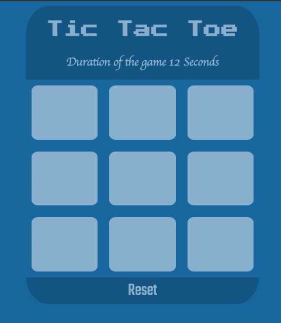

# Project <Tic Tac Toe>

 The Project is a tic tac toe game. It is responsive design. It has timer for the duration of the game. Pop up shall show wheather game end as win or tie. Winning boxs shall have different color.

<!-- Technologies tools -->
- Technologies tools
     * HTML5
     * CSS3
     * JavaScript 
     * Jquery
     * SweetAlert

<!-- Technologies tools -->
## Planning and Development Process
* Day one 
    - Writing HTML structure and design the CSS
* Day two 
    - Check winner and tie 
 * Day three 
    - Game duration counter for the game 
    - Reset button
 * Day four 
    - Writing read me file
    - Responsive design 
 <!-- Function -->
 ```js 

 // check winner
     function checkWin() {
        if (($("#0").text() === $("#1").text()) && ($("#0").text() === $("#2").text()) && ($("#0").text() !== "")) {
            $('#0,#1,#2').css('background', '#CDCDB8')
            $('Audio#wi')[0].play()
            endGame = false
            Swal.fire({
                title: "Congratulations Player  " + $("#0").text() + " WINS",
                timer: 3000
            })

```
<!-- Links -->
[sweetalret]https://sweetalert2.github.io/

[jquery]<script src="https://code.jquery.com/jquery-3.4.1.min.js"integrity="sha256-CSXorXvZcTkaix6Yvo6HppcZGetbYMGWSFlBw8HfCJo="crossorigin="anonymous"></script>

[soundbible](http://soundbible.com)


